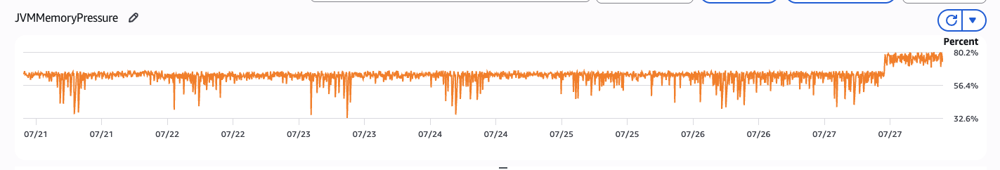

# The Problem

I noticed our OpenSearch JVM memory pressure suddenly increased from around 60% to mearly 80%.

At first, I wasn't sure what was causing it.

- CPU usage was normal.
- The cluster health was green.
- There were no pending tasks.

So I started investigating.